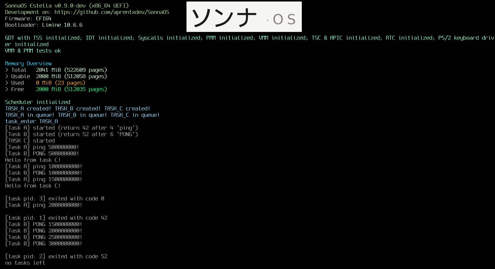

# SonnaOS
Writing an operating system because I want to occupy my time...  

## Kernel
**Estella** - x86_64 EFI kernel using the Limine bootloader protocol.

### Current status
- Boots on x86_64 UEFI (Limine).
- GDT/IDT/TSS up.
- ACPI: RSDP, XSDT, and MADT recognized
- PMM + VMM implemented.
- Huge pages supported.
- Runtime self-tests pass.
### Output
- Serial (debugging)
- Framebuffer console (with Spleen PSF2 font)

### Next:
- APIC, keyboard
- maybe timer

---

---

### Requirements
- clang + ld.lld
- QEMU + OVMF
- make, git, curl/wget

### build & run
```bash
make run
```